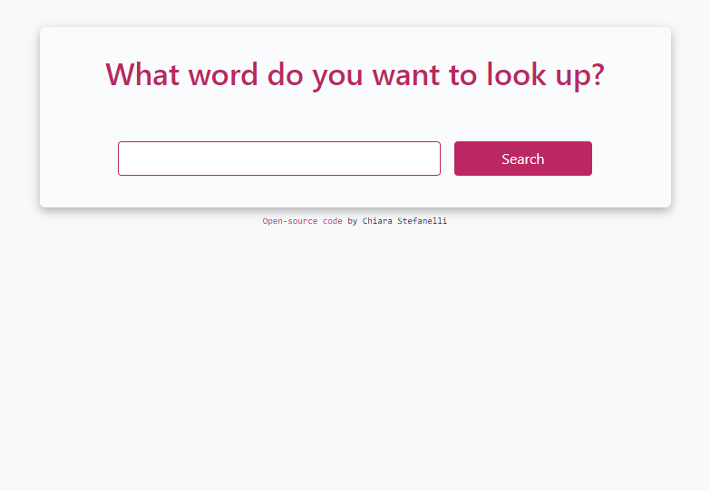

# Dictionary

This is one of the final projects from the [SheCodes React workshop](https://www.shecodes.io/react).

## Link

- [Project url](https://shecodes-dictionary-website.netlify.app/) (hosted on Netlify)

## Screenshots

 

## Project

Users should be able to:

- Look up the definition(s) of the word typed in the search field
- View a list of clickable synonyms that once clicked show their definition
- View photos related to the searched word

## Built with

- HTML
- CSS
- Bootstrap
- JavaScript
- React
- Axios
- [Free Dictionary API](https://dictionaryapi.dev/)
- [Pexels API](https://www.pexels.com/api/)

## Author

Chiara Stefanelli - Front-End Development Student based in Italy

- Website - [Chiara Stefanelli](https://chiarastefanelli.netlify.app/)
- LinkedIn - [Chiara Stefanelli](https://www.linkedin.com/in/chiarastefanelli/?locale=en_US)
- SheCodes profile - [Chiara Stefanelli](https://www.shecodes.io/students/713-chiara-stefanelli)
